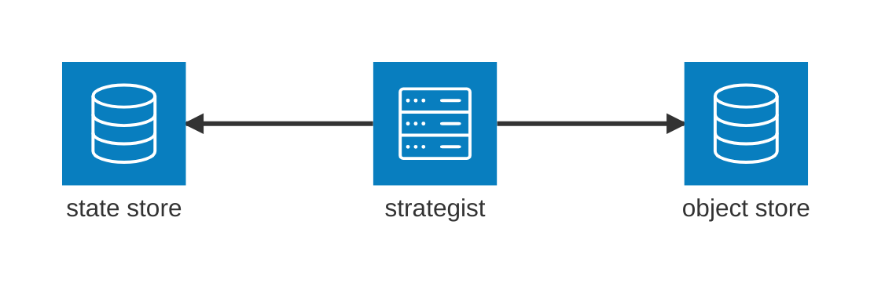

+++
title = "design : alchemiscale strategist"
date = "2025-05-29T14:30:00-07:00"
author = "david@vitalxi"
cover = ""
tags = ["project-alchemiscale", "design"]
keywords = ["", ""]
description = ""
showFullContent = false
readingTime = true
Toc = true
+++


This design document proposes our design for the [**alchemiscale**]() `Strategist` service.
For prior work on this subject, see [Ian Kenney's development log](https://ianmkenney.github.io/devlog/strategiest_implementation/).


# the problem

Users of **alchemiscale** currently [submit an `AlchemicalNetwork`](https://docs.alchemiscale.org/en/latest/user_guide.html#submitting-your-alchemicalnetwork-to-alchemiscale) they wish to compute via the `AlchemiscaleClient`, then [create and action `Task`s](https://docs.alchemiscale.org/en/latest/user_guide.html#creating-and-actioning-tasks) for each `Transformation` in the `AlchemicalNetwork`.
This works just fine, and gives users ultimate control over how to allocate compute across their `Transformation`s, but it also means that users either:

1. waste compute on `Transformation`s that already have converged results by indiscriminantly performing more `Task`s than are needed across the `Transformation`s in an `AlchemicalNetwork`.

2. have to micromanage the compute they allocate by making decisions on which `Transformation`s to perform more `Task`s for.


# our solution

We aim to provide users with another option: define and submit a `Strategy` alongside their `AlchemicalNetwork`, and let this `Strategy` efficiently allocate compute effort across the `Transformation`s until it is satisfied.
This will allow users to largely "fire-and-forget" their `AlchemicalNetwork`s to **alchemiscale**, only concerning themselves with retrieving results as `Task`s complete.

## user interaction

Users can create a parameterized `Strategy` from [`stratocaster`](https://github.com/OpenFreeEnergy/stratocaster), then set this as the `Strategy` on their `AlchemicalNetwork`:


```python
from alchemiscale import AlchemiscaleClient, Scope, ScopedKey
from stratocaster import ConnectivityStrategy

# instantiate client for alchemiscale instance
asc = AlchemiscaleClient('https://api.alchemiscale.localdomain')

# read in a pre-built network; choose a scope to submit to
network = AlchemicalNetwork.from_json('network.json')
scope = Scope('org', 'campaign', 'project')

# submit the network
network_sk: ScopedKey = asc.create_network(network, scope)

# create an instance of a strategy, using default settings
strategy = ConnectivityStrategy(ConnectivityStrategy.default_settings())

# set the strategy for this network
asc.set_network_strategy(network_sk, strategy)

...

# later, retrieve results for the network
results = asc.get_network_results(an_sk)

```

The `Strategy` will automatically be applied by **alchemiscale** to the `AlchemicalNetwork`.
`Task`s will be periodically created and actioned on the `AlchemicalNetwork` as needed based on the `Strategy`'s proposal for how much additional effort to allocate to each `Transformation` given the results accumulated so far.

The `AlchemiscaleClient.set_network_strategy()` method also features the following keyword arguments that adjust how the `Strategy` is performed by **alchemiscale**, independent of the `Strategy`'s own settings:

- `max_tasks_per_transformation` : the maximum number of actioned `Task`s allowed on a `Transformation` at once; default 3

- `max_tasks_per_network` : the max number of actioned `Task`s allowed on the `AlchemicalNetwork` at once; default `None`

- `task_scaling` : modulates how to translate weights into `Task` counts; `"linear"` scales this count directly by weight, while `"exponential"` operates more conservatively by requiring higher weights to yield higher counts

- `sleep_interval` : wait time between iterations of the `Strategy`; the `Strategist` service will have also have a minimum `sleep_interval`, and the larger of the two will take effect

A user can set replace the `Strategy` on the `AlchemicalNetwork` using `set_network_strategy()` as above, or can drop the `Strategy` entirely by calling:

```python
# drop strategy from the network
asc.set_network_strategy(network_sk, None)

```

### modes, states, and introspection

A `Strategy` assigned to an `AlchemicalNetwork` can be in one of the following `mode`s:

1. **full** : the `Strategy` can create, action, and cancel `Task`s on the `AlchemicalNetwork` based on its proposed `Transformation` weights

2. **partial** : the `Strategy` can only create and action `Task`s on the `AlchemicalNetwork` based on its proposed `Transformation` weights; it cannot ever cancel `Task`s

3. **disabled** : the `Strategy` is switched off, and won't be performed by the server

Independent of `mode`, an assigned `Strategy` also has a `status`.
`status` may be one of the following:

1. **awake** : the `Strategy` has not hit any stop conditions, and has not errored; it will performed according to its `mode`

2. **dormant** : the `Strategy` has reached stop conditions, and will no longer be performed until new results appear

3. **error** : the `Strategy` has encountered an `Exception`, and will no longer be performed


The `mode` is set by the user, and changes the way the `Strategist` service handles the `Strategy`.
The `status` of the `Strategy` is changed by the `Strategist` over time based on execution conditions, and can be manually set back to **awake** by a user.
See [the `Strategist` service]() section for details.


Users can interrogate `Strategy` health with:

```python
> asc.get_network_strategy_health(an_sk)
StrategyHealth(mode: 'partial', status: 'awake', iterations: 4, sleep_interval: 3600, 
               last_iteration: '2025-05-30T18:24:30.540413+00:00',
               last_iteration_result_count: 1213) 

```

Or specifically ask for its `state`:

```python
> asc.get_network_strategy_state(an_sk)
'partial'

```

And can retrieve the `Strategy` with:

```python
> asc.get_network_strategy(an_sk)
<ConnectivityStrategy-d78edfd56996deef89deb19e231d0e79>

```

This is useful if a user wants to make a new `Strategy` based on the settings of the current one, but with some modifications.


## the Strategist service

All `Strategy`s submitted by users are performed server-side by the `Strategist` service.
This service directly interfaces with the state and object stores in the same way as the API services do, minimizing latency and complexity.



The service performs the following sequence as cycles in an infinite loop:

1. Query the state store for all non-**disabled** and non-**error** `Strategy`s.

2. For each `Strategy` due for an iteration based on `sleep_interval`, dispatch the following to `ProcessPoolExecutor`:
    
    - If the `Strategy` is **dormant**, check the number of successful `ProtocolDAGResult`s against last recorded count.
        
        - If different, switch `status` to `awake` and proceed; if not, remain `dormant` and skip.

    - Pull the `AlchemicalNetwork` and all successful `ProtocolDAGResult`s for each `Transformation`, and gather into `ProtocolResult`s.

    - Feed these to `Strategy.propose()` to yield a `StrategyResult`, and acquire normalized `Transformation` weights with `StrategyResult.resolve()`.
        
        - If weights are all `None`, set `Strategy` `status` to **dormant** and skip. If `Strategy` `mode` is **full**, cancel all actioned `Task`s on the `AlchemicalNetwork`.

    - Convert these weights into `Task` counts for each `Transformation` (see [below]() for how we do this).

    - Set the count of actioned `Task`s for each `Transformation`, creating new `Task`s as necessary.

        - If `Strategy` `mode` is **full**, cancel `Task`s as necessary on `Transformation`s that have too many `Task`s actioned.

    - Update the `Strategy` `iteration` count, number of successful `ProtocolDAGResult`s encountered, `last_iteration` datetime.

    - If any of the above steps failed, set `Strategy` state to **error**.
    

3. Sleep for configured `Strategist` `sleep_interval`.


### proposal weights to Task counts

We require a mechanism for translating normalized `Strategy` proposal weights (continuous values from 0 to 1) into discrete `Task` counts for the `Transformation`s in an `AlchemicalNetwork`.
There are likely many reasonable ways to do this, but we propose the following per `Transformation`:

```python

w: float
max_tasks_per_transformation: int
task_scaling: str

if w == 0:
    tasks = 0
elif w == 1:
    tasks = max_tasks_per_transformation
else:
    if task_scaling == 'linear':
        tasks = int(1 + w * max_tasks_per_transformation)
    elif task_scaling == 'exponential':
        tasks = int((1 + max_tasks_per_transformation)**w)

```

These values will then 


### Strategy status changes

A `Strategy` that has failed to provide a proposal due to an `Exception` will have its state set to `"error"`.


## miscellanea

Additional notes:

1. The `Strategist` should not create and action any new `Task`s on a `Transformation` featuring `Task`s with `status = error`.
    - users should deal with these `error`ed `Task`s in order to clear the `Transformation` for handling by the `Strategy`

2. The `Strategist` must feature an LRU cache of substantial max size for `ProtocolDAGResult`s, reducing the need to pull them from the object store each time it performs a `Strategy` iteration.

3. We later want to include a mechanism for making `Strategy`s perform extensions from existing `Task`s on a `Transformation`. One idea is to include an `extends_preference` keyword argument to `AlchemiscaleClient.set_network_strategy()` with the following behavior:
    - if `0`, perform no extensions at all
    - if `1`, always perform extension when possible
    - if between `0` and `1`, extend or not extend in proportion to this value (e.g. `0.7` would mean around 70% of `Task`s created would extend from another `Task`)
